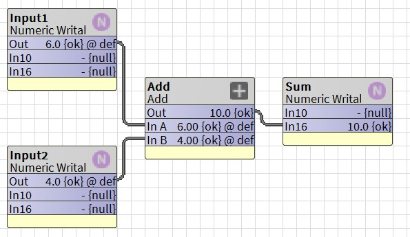

# pybog: A Python Toolkit for Niagara BOG & DIST Files


This project provides a Python library to **analyze**, **parse**, and **generate** Tridium Niagara `.bog` and `.dist` files. It allows developers, controls engineers, and AI systems to work with Niagara control logic **offline**, without requiring Workbench.

By parsing complex JACE backup files into formats that AI/LLMs can understand, the tool enables powerful new workflows for **commissioning agents**, **field technicians**, and **consulting engineers**—such as conversing with an LLM to explain how the supervisory logic is structured.

The **ultimate goal** of the project is to enable AI to **generate Niagara Wiresheet logic**—from basic control sequences to advanced supervisory strategies, such as those defined in **ASHRAE Guideline 36**. Looking ahead, the tool aims to support **AI-driven translation** of control algorithms written in **Python**, **C++**, **JavaScript**, or other general-purpose, high-level C-style languages into Niagara Wiresheet logic. This would allow complex, algorithmic control logic authored by AI to be exported as `.bog` files, ready for human users to import, inspect, and test directly within the Niagara environment.


[🎥 Keep Up with Talk Shop With Ben on YouTube](https://www.youtube.com/@TalkShopWithBen)

---

<details>
<summary><strong>🔧 Dump a .dist or .bog to JSON </strong></summary>

You can now use `main.py` to:

- Analyze any `.bog` or `.dist` file
- Extract the logic structure into clean **JSON**
- Enable downstream processing, such as LLM prompting, visualization, or diagnostics

```bash
python main.py "C:\your\path\to\backup_Ahu4.dist" -o "C:\your\path\to\backup_Ahu4.json" -l
```
---

### ✅ Argument Descriptions

| Argument                                | Meaning                                                                                                                                                                     |
| --------------------------------------- | --------------------------------------------------------------------------------------------------------------------------------------------------------------------------- |
| `"C:\your\path\to\backup_Ahu4.dist"`    | **Positional argument**: path to the `.dist` or `.bog` file you want to analyze.                                                                                            |
| `-o "C:\your\path\to\backup_Ahu4.json"` | **Optional** `--output` flag: specifies the output path for the generated `.json` file.                                                                                     |
| `-l`                                    | **Optional** `--list` flag: tells the script to **print a list** of control logic components or metadata from the file, instead of (or in addition to) writing full output. |

</details>

---

<details>
<summary><strong>👷 Write Your Own `.bog` File in XML from scratch</strong></summary>

The Python script operates by creating the entire XML structure of the Niagara .bog file as a single, multi-line text string. This string contains all the necessary tags to define each component, its properties, and the links between them. Finally, the script writes this complete XML string directly into a new file, which Niagara can then open and display as a standard wiresheet.

### ✨ Code Example

```python
xml_content = '''<bajaObjectGraph version="4.0" reversibleEncodingKeySource="none" FIPSEnabled="false" reversibleEncodingValidator="[null.1]=">
  <p t="b:UnrestrictedFolder" m="b=baja">
    <p n="MyAdderLogic" t="b:Folder">

      <!-- Input1: Settable point with default value -->
      <p n="Input1" t="control:NumericWritable" h="1" m="control=control">
        <p n="out" f="s" t="b:StatusNumeric">
          <p n="value" v="6.0"/>
          <p n="status" v="0;activeLevel=e:17@control:PriorityLevel"/>
        </p>
        <p n="fallback" t="b:StatusNumeric">
          <p n="value" v="6.0"/>
        </p>
        <a n="emergencyOverride" f="h"/>
        <a n="emergencyAuto" f="h"/>
        <a n="override" f="ho"/>
        <a n="auto" f="ho"/>
        <p n="wsAnnotation" t="b:WsAnnotation" v="10,10,8"/>
      </p>
      
      <!-- Input2: Settable point with default value -->
      <p n="Input2" t="control:NumericWritable" h="2" m="control=control">
        <p n="out" f="s" t="b:StatusNumeric">
          <p n="value" v="4.0"/>
          <p n="status" v="0;activeLevel=e:17@control:PriorityLevel"/>
        </p>
        <p n="fallback" t="b:StatusNumeric">
          <p n="value" v="4.0"/>
        </p>
        <a n="emergencyOverride" f="h"/>
        <a n="emergencyAuto" f="h"/>
        <a n="override" f="ho"/>
        <a n="auto" f="ho"/>
        <p n="wsAnnotation" t="b:WsAnnotation" v="10,20,8"/>
      </p>

      <!-- Add: Logic block with verbose links -->
      <p n="Add" t="kitControl:Add" h="3" m="kitControl=kitControl">
        <p n="wsAnnotation" t="b:WsAnnotation" v="20,15,8"/>
        <p n="Link" t="b:Link">
          <p n="sourceOrd" v="h:1"/>
          <p n="relationId" v="n:dataLink"/>
          <p n="sourceSlotName" v="out"/>
          <p n="targetSlotName" v="inA"/>
        </p>
        <p n="Link1" t="b:Link">
          <p n="sourceOrd" v="h:2"/>
          <p n="relationId" v="n:dataLink"/>
          <p n="sourceSlotName" v="out"/>
          <p n="targetSlotName" v="inB"/>
        </p>
      </p>
      
      <!-- Sum: Read-only point with Set action explicitly hidden -->
      <p n="Sum" t="control:NumericWritable" h="4" m="control=control">
        <p n="out" f="h"/>
        <a n="emergencyOverride" f="h"/>
        <a n="emergencyAuto" f="h"/>
        <a n="override" f="ho"/>
        <a n="auto" f="ho"/>
        <a n="set" f="ho"/>
        <p n="wsAnnotation" t="b:WsAnnotation" v="30,15,8"/>
        <p n="Link" t="b:Link">
          <p n="sourceOrd" v="h:3"/>
          <p n="relationId" v="n:dataLink"/>
          <p n="sourceSlotName" v="out"/>
          <p n="targetSlotName" v="in16"/>
        </p>
      </p>

    </p>
  </p>
</bajaObjectGraph>'''

with open("PyMadeAddr.bog", "w", encoding="utf-8") as f:
    f.write(xml_content)

```

### 📌 How it Works

* Each `<p>` tag represents a Niagara component or a **slot within a component** (like `out` or `fallback`). Each `<a>` tag represents an **action** on that component, like `set` or `override`.

* The `f` attribute (flags) is critical for controlling behavior. `f="s"` makes a slot **settable**, while `f="h"` or `f="ho"` **hides** a slot or action, which is how we create read-only points.

* To set a **default value**, the `out` and `fallback` slots must be fully defined as complex properties containing nested `<p n="value".../>` and `<p n="status".../>` tags.

* `h="1"`, `h="2"`, etc., are unique **handles** that links use to reference their source and target components.

* `wsAnnotation` controls the block's position on the wiresheet. The coordinates are calculated using our **Hierarchical Data Flow** strategy to ensure a clean, grid-based layout.

* The `Add` block's links use these handles to reference the `out` slots from `Input1` and `Input2` and connect them to its `inA` and `inB` inputs.





</details>

---

<details>
<summary><strong>🐍 Py Bog Building Example</strong></summary>

```python
import sys
import os
import argparse

# Add the 'src' directory to the Python path
sys.path.append(os.path.abspath(os.path.join(os.path.dirname(__file__), "..")))
# Make sure you are importing the new builder with sub-folder capabilities
from src.bog_builder_new import BogFolderBuilder


def main():
    parser = argparse.ArgumentParser(
        description="Build a complex, multi-algorithm .bog file with a clean, multi-folder layout."
    )
    parser.add_argument(
        "-o", "--output_dir", default="examples", help="Output directory."
    )
    args = parser.parse_args()

    script_filename = os.path.basename(__file__).replace(".py", "")

    # 1. Initialize the builder
    builder = BogFolderBuilder("MultiAlgorithmTest")

    # 2. Define TOP-LEVEL input and output blocks.
    # These will be the only components visible on the main wiresheet,
    # alongside the folders containing the logic.
    # --- Inputs ---
    builder.add_numeric_writable(name="Input1", default_value=10.0)
    builder.add_numeric_writable(name="Input2", default_value=20.0)
    builder.add_numeric_writable(name="Input3", default_value=30.0)
    builder.add_numeric_writable(name="Input4", default_value=40.0)
    builder.add_numeric_writable(name="Input5", default_value=50.0)
    builder.add_numeric_writable(name="Input6", default_value=60.0)
    builder.add_numeric_writable(name="Input7", default_value=70.0)
    builder.add_numeric_writable(name="Input8", default_value=80.0)
    builder.add_numeric_writable(name="Input9", default_value=90.0)
    builder.add_numeric_writable(name="Input10", default_value=100.0)
    builder.add_numeric_writable(name="Input11", default_value=110.0)

    # --- Outputs ---
    builder.add_numeric_writable(name="Min_Final")
    builder.add_numeric_writable(name="Max_Final")
    builder.add_numeric_writable(name="Avg_Final")


    # TUTORIAL: USING MULTIPLE SUB-FOLDERS
    # Since this script performs three separate calculations, we can give each one
    # its own sub-folder for maximum organization. This keeps the logic for
    # Average, Minimum, and Maximum completely separate and easy to debug.

    # --- Average Calculation Sub-Folder ---
    # To see the Average logic flat, comment out the next two lines.
    builder.start_sub_folder("AverageLogic")
    builder.add_component(comp_type="kitControl:Average", name="Avg1")
    builder.add_component(comp_type="kitControl:Average", name="Avg2")
    builder.add_component(comp_type="kitControl:Average", name="Avg3")
    builder.add_component(comp_type="kitControl:Average", name="Avg4")
    builder.end_sub_folder()

    # --- Minimum Calculation Sub-Folder ---
    # To see the Minimum logic flat, comment out the next two lines.
    builder.start_sub_folder("MinimumLogic")
    builder.add_component(comp_type="kitControl:Minimum", name="Min1")
    builder.add_component(comp_type="kitControl:Minimum", name="Min2")
    builder.add_component(comp_type="kitControl:Minimum", name="Min3")
    builder.add_component(comp_type="kitControl:Minimum", name="Min4")
    builder.end_sub_folder()

    # --- Maximum Calculation Sub-Folder ---
    # To see the Maximum logic flat, comment out the next two lines.
    builder.start_sub_folder("MaximumLogic")
    builder.add_component(comp_type="kitControl:Maximum", name="Max1")
    builder.add_component(comp_type="kitControl:Maximum", name="Max2")
    builder.add_component(comp_type="kitControl:Maximum", name="Max3")
    builder.add_component(comp_type="kitControl:Maximum", name="Max4")
    builder.end_sub_folder()


    # 3. Register all links.
    # No changes are needed here. The builder will create proxies automatically
    # as these links cross in and out of the three different sub-folders.

    # --- Links for Average Logic ---
    builder.add_link("Input1", "out", "Avg1", "inA")
    builder.add_link("Input2", "out", "Avg1", "inB")
    builder.add_link("Input3", "out", "Avg1", "inC")
    builder.add_link("Input4", "out", "Avg1", "inD")
    builder.add_link("Input5", "out", "Avg2", "inA")
    builder.add_link("Input6", "out", "Avg2", "inB")
    builder.add_link("Input7", "out", "Avg2", "inC")
    builder.add_link("Input8", "out", "Avg2", "inD")
    builder.add_link("Input9", "out", "Avg3", "inA")
    builder.add_link("Input10", "out", "Avg3", "inB")
    builder.add_link("Input11", "out", "Avg3", "inC")
    builder.add_link("Avg1", "out", "Avg4", "inA")
    builder.add_link("Avg2", "out", "Avg4", "inB")
    builder.add_link("Avg3", "out", "Avg4", "inC")
    builder.add_link("Avg4", "out", "Avg_Final", "in16")

    # --- Links for Minimum Logic ---
    builder.add_link("Input1", "out", "Min1", "inA")
    builder.add_link("Input2", "out", "Min1", "inB")
    builder.add_link("Input3", "out", "Min1", "inC")
    builder.add_link("Input4", "out", "Min1", "inD")
    builder.add_link("Input5", "out", "Min2", "inA")
    builder.add_link("Input6", "out", "Min2", "inB")
    builder.add_link("Input7", "out", "Min2", "inC")
    builder.add_link("Input8", "out", "Min2", "inD")
    builder.add_link("Input9", "out", "Min3", "inA")
    builder.add_link("Input10", "out", "Min3", "inB")
    builder.add_link("Input11", "out", "Min3", "inC")
    builder.add_link("Min1", "out", "Min4", "inA")
    builder.add_link("Min2", "out", "Min4", "inB")
    builder.add_link("Min3", "out", "Min4", "inC")
    builder.add_link("Min4", "out", "Min_Final", "in16")

    # --- Links for Maximum Logic ---
    builder.add_link("Input1", "out", "Max1", "inA")
    builder.add_link("Input2", "out", "Max1", "inB")
    builder.add_link("Input3", "out", "Max1", "inC")
    builder.add_link("Input4", "out", "Max1", "inD")
    builder.add_link("Input5", "out", "Max2", "inA")
    builder.add_link("Input6", "out", "Max2", "inB")
    builder.add_link("Input7", "out", "Max2", "inC")
    builder.add_link("Input8", "out", "Max2", "inD")
    builder.add_link("Input9", "out", "Max3", "inA")
    builder.add_link("Input10", "out", "Max3", "inB")
    builder.add_link("Input11", "out", "Max3", "inC")
    builder.add_link("Max1", "out", "Max4", "inA")
    builder.add_link("Max2", "out", "Max4", "inB")
    builder.add_link("Max3", "out", "Max4", "inC")
    builder.add_link("Max4", "out", "Max_Final", "in16")

    # 4. Save the file.
    bog_filename = f"{script_filename}.bog"
    output_path = os.path.join(args.output_dir, bog_filename)
    os.makedirs(args.output_dir, exist_ok=True)
    builder.save(output_path)
    print(f"\nSuccessfully created Niagara .bog file at: {output_path}")


if __name__ == "__main__":
    main()
```

### Top-Level WireSheet Made from Python Script
This example shows the same **Min/Max/Average** logic built directly on the **top-level wiresheet**:


### Average Folder Contents
This example shows the **Min/Max/Average** logic grouped within a dedicated folder:


## The real question will be can AI create advanced supervisory level algorithms for HVAC in Wiresheet format perhaps in a style like this?

</details>


<details>
<summary><strong>Bog Builder Test Plan: Common HVAC Algorithms</strong></summary>

## Tested `.bog` Builder Scripts

Here is a list of tested scripts that generate `.bog` files for **bog file building**.  
Each one replicates real-world HVAC control logic as seen in actual JACE backups created by field DDC technicians.

---

### ✅ Math and Logic Tests:
1. ✅ **four_in_add_logic.py**  
   Simple 4-input adder (`Input1 + Input2 + Input3 + Input4`).

2. ✅ **subtract_simple.py**  
   Basic subtraction (`Input_A - Input_B`).

3. ✅ **simple_math_logic.py**  
   Multi-step math: `((Input_A + Input_B) * Input_C) / Input_D`.

4. ✅ **addition_complicated.py**  
   8-input adder organized with a **sub-folder** (`Input1-8 summed`).

5. ✅ **average_min_max.py**  
   Calculates **average**, **minimum**, and **maximum** across 11 inputs using **three organized sub-folders**.

6. ✅ **bool_logic_playground.py**  
   Playground for `AND`, `OR`, `XOR`, `NOT`, `EQUAL`, `NOT EQUAL`, `GT`, `GTE`, `LT`, `LTE`.

7. ✅ **boolean_numeric_switch.py**  
   Combines boolean logic with a numeric switch for selecting between math results.

8. ✅ **zone_occ_setpoint_switch.py**  
   Occupied/unoccupied zone setpoint selection using a **NumericSwitch**.

9. ✅ **find_max_value.py**  
   Finds the **maximum value** from 10 VAV damper positions using a tournament tree.

10. ✅ **find_second_highest_of_6.py**  
    Finds the **highest** and **second-highest** values from 6 inputs.


---

### 🧠 Combined Algorithm Tests:
TODO

---

### 🧩 Advanced Data Type & Optimization Tests (21–25):
Exploritory processes to see if AI can create advanced wire sheet algorithms.

TODO

</details>


---

## 🧱 Component Library (kitControl)

Reference logic building blocks from Niagara’s kitControl palette are documented in `pdf/docKitControl.pdf`.

---

## 📄 License

MIT License — free for reuse with attribution.

