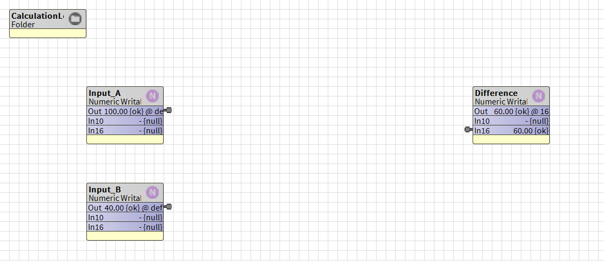
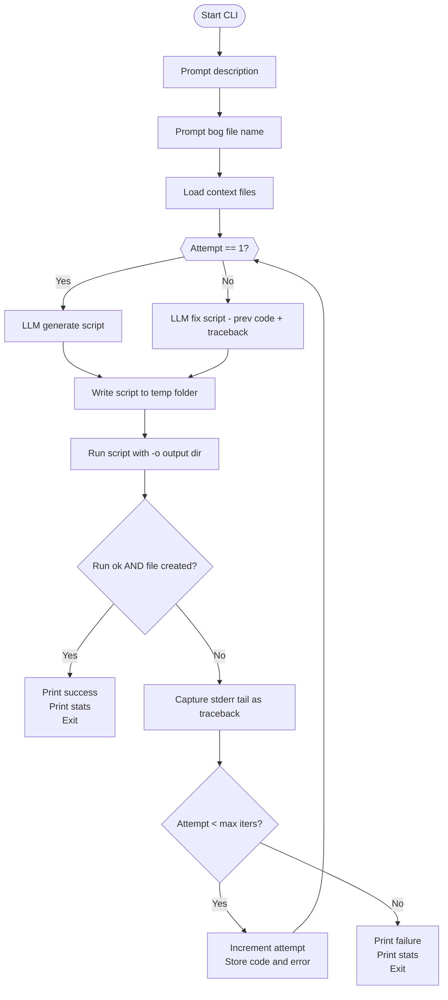

# pybog: A Python Toolkit for Niagara BOG & DIST Files

`bog_builder` is a Python package for constructing Niagara Baja Object Graphs `.bog` files programmatically. The goal is for AI to assist human controls engineers in rapidly prototyping complex HVAC sequencing within wire sheet logic. If the software engineering community can prototype quickly, why shouldn’t the controls engineering community be able to do the same?


## Local Python Project Setup
On WSL in the root directory afer after cloning project run:
>
> ```bash
> wsl
> pip install .
> ```
>

To uninstall bog_builer if developing
> ```bash
> pip uninstall bog_builder
> ```
>

Optinal run unit tests
> pytest


## Running Example Scripts with WSL

Each example script can be executed directly in **WSL (Windows Subsystem for Linux)** to generate a `.bog` file and drop it straight into your Niagara Workbench `JENEsys` directory. All example Python files are also compiled into a text file and used for LLM context.


1. **Run a specific example from project root directory**
   Pass the Niagara Workbench path as the output directory (`-o` argument):

   ```bash
   python examples/bool_latch_play_ground.py -o /mnt/c/Users/ben/Niagara4.11/JENEsys
   ```

   This will create:

   ```
   /mnt/c/Users/ben/Niagara4.11/JENEsys/bool_latch_play_ground.bog
   ```

2. **Open Workbench**
   Now you can import or open the generated `.bog` file inside your Niagara Workbench environment under the JENEsys station.

---

⚡ **Tip:**
If you don’t want to type `-o` every time, you can edit each example script and change the default in its argparse:

```python
parser.add_argument(
    "-o",
    "--output_dir",
    default="/mnt/c/Users/ben/Niagara4.11/JENEsys",
    help="Output directory for the .bog file."
)
```

Then you can just run:

```bash
python examples/bool_latch_play_ground.py
```

and it will always drop files directly into your Workbench directory for easy fast testing.

---

## Bog Builder Python API Example

This is a code snip from the `examples\subtract_simple.py` file with optional `start_sub_folder` folder structures.

```python
builder = BogFolderBuilder("SubtractionLogic")

# --- Inputs ---
builder.add_numeric_writable(name="Input_A", default_value=100.0)
builder.add_numeric_writable(name="Input_B", default_value=40.0)

# --- Output ---
builder.add_numeric_writable(name="Difference")

builder.start_sub_folder("CalculationLogic")
builder.add_component(comp_type="kitControl:Subtract", name="Subtract")

builder.end_sub_folder()

builder.add_link("Input_A", "out", "Subtract", "inA")
builder.add_link("Input_B", "out", "Subtract", "inB")
builder.add_link("Subtract", "out", "Difference", "in16")

bog_filename = f"{script_filename}.bog"
output_path = os.path.join(args.output_dir, bog_filename)
os.makedirs(args.output_dir, exist_ok=True)
builder.save(output_path)
print(f"\nSuccessfully created Niagara .bog file at: {output_path}")

```


When run, it will create a `.bog` file that can be directly imported into Workbench. Behind the scenes, `pybog` automatically arranges the grid layout to keep it neat and human-readable. Placing logic inside subfolders is optional, but it’s a great way to keep your bog files organized and clean. And yes—AI can handle all of this for you, too 😉.


```bash
python examples/subtract_simple.py -o /mnt/c/Users/ben/Niagara4.11/JENEsys
```




## Write Your Own `.bog` File in XML from scratch

The Python script operates by creating the entire XML structure of the Niagara .bog file as a single, multi-line text string. This string contains all the necessary tags to define each component, its properties, and the links between them. Finally, the script writes this complete XML string directly into a new file, which Niagara can then open and display as a standard wiresheet.

```python
xml_content = '''<bajaObjectGraph version="4.0" reversibleEncodingKeySource="none" FIPSEnabled="false" reversibleEncodingValidator="[null.1]=">
  <p t="b:UnrestrictedFolder" m="b=baja">
    <p n="MyAdderLogic" t="b:Folder">

      <!-- Input1: Settable point with default value -->
      <p n="Input1" t="control:NumericWritable" h="1" m="control=control">
        <p n="out" f="s" t="b:StatusNumeric">
          <p n="value" v="6.0"/>
          <p n="status" v="0;activeLevel=e:17@control:PriorityLevel"/>
        </p>
        <p n="fallback" t="b:StatusNumeric">
          <p n="value" v="6.0"/>
        </p>
        <a n="emergencyOverride" f="h"/>
        <a n="emergencyAuto" f="h"/>
        <a n="override" f="ho"/>
        <a n="auto" f="ho"/>
        <p n="wsAnnotation" t="b:WsAnnotation" v="10,10,8"/>
      </p>
      
      <!-- Input2: Settable point with default value -->
      <p n="Input2" t="control:NumericWritable" h="2" m="control=control">
        <p n="out" f="s" t="b:StatusNumeric">
          <p n="value" v="4.0"/>
          <p n="status" v="0;activeLevel=e:17@control:PriorityLevel"/>
        </p>
        <p n="fallback" t="b:StatusNumeric">
          <p n="value" v="4.0"/>
        </p>
        <a n="emergencyOverride" f="h"/>
        <a n="emergencyAuto" f="h"/>
        <a n="override" f="ho"/>
        <a n="auto" f="ho"/>
        <p n="wsAnnotation" t="b:WsAnnotation" v="10,20,8"/>
      </p>

      <!-- Add: Logic block with verbose links -->
      <p n="Add" t="kitControl:Add" h="3" m="kitControl=kitControl">
        <p n="wsAnnotation" t="b:WsAnnotation" v="20,15,8"/>
        <p n="Link" t="b:Link">
          <p n="sourceOrd" v="h:1"/>
          <p n="relationId" v="n:dataLink"/>
          <p n="sourceSlotName" v="out"/>
          <p n="targetSlotName" v="inA"/>
        </p>
        <p n="Link1" t="b:Link">
          <p n="sourceOrd" v="h:2"/>
          <p n="relationId" v="n:dataLink"/>
          <p n="sourceSlotName" v="out"/>
          <p n="targetSlotName" v="inB"/>
        </p>
      </p>
      
      <!-- Sum: Read-only point with Set action explicitly hidden -->
      <p n="Sum" t="control:NumericWritable" h="4" m="control=control">
        <p n="out" f="h"/>
        <a n="emergencyOverride" f="h"/>
        <a n="emergencyAuto" f="h"/>
        <a n="override" f="ho"/>
        <a n="auto" f="ho"/>
        <a n="set" f="ho"/>
        <p n="wsAnnotation" t="b:WsAnnotation" v="30,15,8"/>
        <p n="Link" t="b:Link">
          <p n="sourceOrd" v="h:3"/>
          <p n="relationId" v="n:dataLink"/>
          <p n="sourceSlotName" v="out"/>
          <p n="targetSlotName" v="in16"/>
        </p>
      </p>

    </p>
  </p>
</bajaObjectGraph>'''

with open("PyMadeAddr.bog", "w", encoding="utf-8") as f:
    f.write(xml_content)

```

### How it Works

* Each `<p>` tag represents a Niagara component or a **slot within a component** (like `out` or `fallback`). Each `<a>` tag represents an **action** on that component, like `set` or `override`.
* The `f` attribute (flags) is critical for controlling behavior. `f="s"` makes a slot **settable**, while `f="h"` or `f="ho"` **hides** a slot or action, which is how we create read-only points.
* To set a **default value**, the `out` and `fallback` slots must be fully defined as complex properties containing nested `<p n="value".../>` and `<p n="status".../>` tags.
* `h="1"`, `h="2"`, etc., are unique **handles** that links use to reference their source and target components.
* `wsAnnotation` controls the block's position on the wiresheet. The coordinates are calculated using our **Hierarchical Data Flow** strategy to ensure a clean, grid-based layout.
* The `Add` block's links use these handles to reference the `out` slots from `Input1` and `Input2` and connect them to its `inA` and `inB` inputs.


---

python examples/bool_latch_play_ground.py -o /mnt/c/Users/ben/Niagara4.11/JENEsys


## 🚀 LLM Agent - `generic_agent.py`

Experimental Iterative **BOG File Builder**!
Tested on **WSL** 🐧  
Powered by a **FREE API Key** from [Google AI Studio](https://aistudio.google.com/apikey) 🔑  
Running with **Gemini-2.5 Flash** ⚡


From the WSL bash console, set your API key as a temporary OS environment variable:

```bash
export GOOGLE_API_KEY="PASTE_IT_HERE"
```

The `generic_agent.py` reads in your API key, lets you input a desired an HVAC control sequence, and iteratively synthesizes a runnable Python builder script that creates a Niagara `.bog` file.  

It works like this:

1. **Prompt for description**  
   You’ll be asked to describe the control system logic you want (e.g. *"Create a central plant with heating and cooling setpoints of 40°F/45°F and 75°F/70°F with a free cooling range between 50 and 60°F"*).

2. **Prompt for bog file name**  
   You’ll also be asked to give a short, human-friendly name for the output file (e.g. *"central_plant_sequencing"*).  
   The agent forces the generated script to save exactly to that file, e.g.:  
   `/mnt/c/Users/ben/Niagara4.11/JENEsys/central_plant_sequencing.bog`

3. **Synthesize → Run → Fix loop**  
   - Attempt 1: the LLM generates a Python script into `.agent_tmp/` and runs it.  
   - If it fails, the agent captures the full traceback and sends both the failing code and the error back to the LLM.  
   - The LLM then repairs the script and tries again.  
   - This repeats up to `--max-iters` times (default 4).  

4. **Result**  
   Once successful, you’ll see debug logs from `BogFolderBuilder` and a success message where then you can open it right up in Workbench:  

```

✅ Generated .bog file at: /mnt/c/Users/ben/Niagara4.11/JENEsys/central\_plant\_sequencing.bog

```

5. **Stats**  
At the end, the script prints how many Gemini API calls were used and how many attempts were needed.  

Example:

```

—— Stats ——
Gemini calls: 4
Attempts: 4
Total input tokens: 18636
Total output tokens: 2249
Total tokens: 20885

```

---

### Command-line arguments

```bash
python generic_agent.py [--output <path>] [--max-iters N] [--workdir <dir>]
```

* `--output`: optional final destination for the `.bog`. If omitted, the file stays in the default Niagara output dir (`Niagara4.11/JENEsys`).
* `--max-iters`: max number of generate→run→fix attempts (default 4).
* `--workdir`: scratch directory for synthesized Python scripts (default `.agent_tmp/`).
  You should add `.agent_tmp/` to `.gitignore` since it only contains temporary generated scripts.


### Prompt Chaining Activity Diagram
* Note - It is very experimental but working and subject to change once better methods can be created. TODO research MCP server to burn less tokens currently it uses LOTS of tokens in the context files sent to LLM service.



---

### Generate Context Text Files

The **context directory** contains documentation specifically formatted for use by the LLM agent.
Running the generator will take all Python files in the `examples` directory and combine them into a set of **LLM-friendly documentation files** (see [GoFast MCP docs](https://gofastmcp.com/getting-started/welcome#llm-friendly-docs) for the format specification).

* **`llms.txt`** — a lightweight *sitemap* listing each example file and its relative path.
* **`llms-full.txt`** — a single, concatenated file with the complete source of every example, wrapped with clear delimiters (`=== FILE: ... ===`, `=== CODE START ===`, `=== CODE END ===`).
  ⚠️ *Note:* this file can be quite large and may exceed the context window of some LLMs. For this project the `llms-full.txt` can push upwords of 20,000 tokens.

Generate the docs with:

```bash
python src/bog_builder/generate_llm_docs.py --examples examples --output context
```

This ensures the agent has direct access to all available example scripts, either as a quick index (`llms.txt`) or full training context (`llms-full.txt`).

---

## Traversing Baja Object Graphs

TODO RESEARCH:

Niagara represents the contents of a station as a directed graph of
objects and properties.  When working with the raw XML stored inside
``.bog`` and ``.dist`` archives you are effectively traversing this
graph.  The graph is not strictly hierarchical: components can have
links and references to other components across folders, and cycles
may exist in more complex projects.  The following best practices
apply when traversing Baja object graphs programmatically:

* **Parse once, traverse many.**  Extract the ``file.xml`` contents
  into an ``xml.etree.ElementTree`` and hold onto the root element.
  Re‑parsing the XML repeatedly is expensive.
* **Use breadth‑first or depth‑first search with a visited set.**
  Each component element has a unique handle (the ``h`` attribute).
  Keep a set of visited handles to avoid infinite loops when
  following links and references.
* **Follow both containment and link relationships.**  Components are
  nested via ``<p h=...>`` elements, but logical connections are
  represented via ``b:Link`` child elements.  To reconstruct the
  full dependency graph you must consider both.
* **Build a handle→name map.**  It is common to refer to components
  by their handle in link definitions (e.g. ``s="h:123"``).  Create
  a dictionary mapping ``h:<handle>`` strings to component names so
  you can resolve these references during traversal.
* **Be mindful of palettes.**  The ``type`` attribute on each
  component encodes the palette and the block name (e.g.
  ``kitControl:Add``).  Grouping components by palette can help
  narrow your search or generate statistics.

The ``Analyzer`` class in ``bog_builder.analyzer`` encapsulates these
patterns.  It parses a station or BOG file, extracts a flat list of
components along with their properties and links, and can build a
handle map for you.  Beyond basic analysis, it includes helpers to
count how many ``kitControl`` components of each type are used and
generate visualisations of this data.  For example, to analyse a
``.dist`` file and produce bar and pie charts summarising the
kitControl blocks it contains:

```bash
python -m bog_builder.analyzer "/path/to/file.dist" \
  -o "/path/to/output.json" \
  --plots "/path/to/outputdir"

```

This command writes JSON analysis to stdout, prints a sorted list of
kitControl counts, and saves two images into ``analysis/plots``: one
bar chart and one pie chart.  These charts can provide insight into
which Niagara control blocks are most common in a given station.

---

[🎥 Keep Up with Talk Shop With Ben on YouTube](https://www.youtube.com/@TalkShopWithBen)

---

## Component Library (kitControl)

Reference logic building blocks from Niagara’s kitControl palette are documented in `pdf/docKitControl.pdf`.

---

## License

MIT License — free for reuse with attribution. Pull requests welcome.

