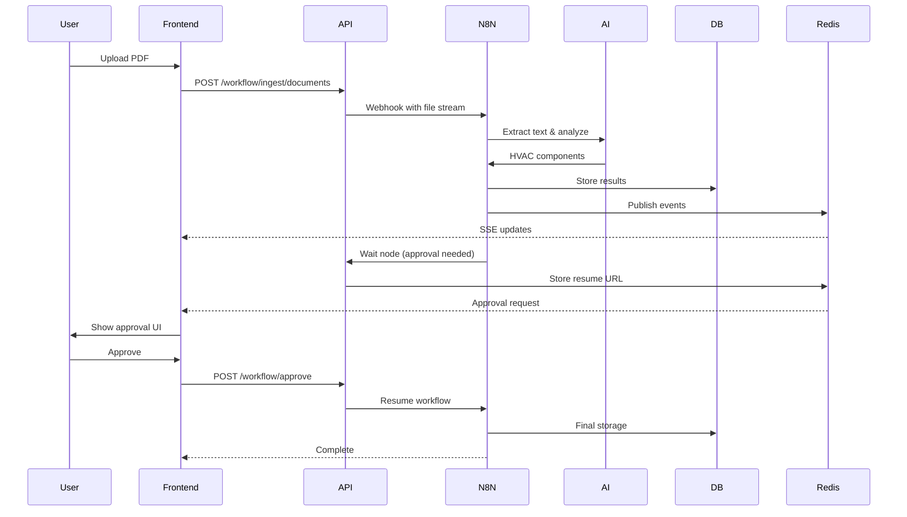
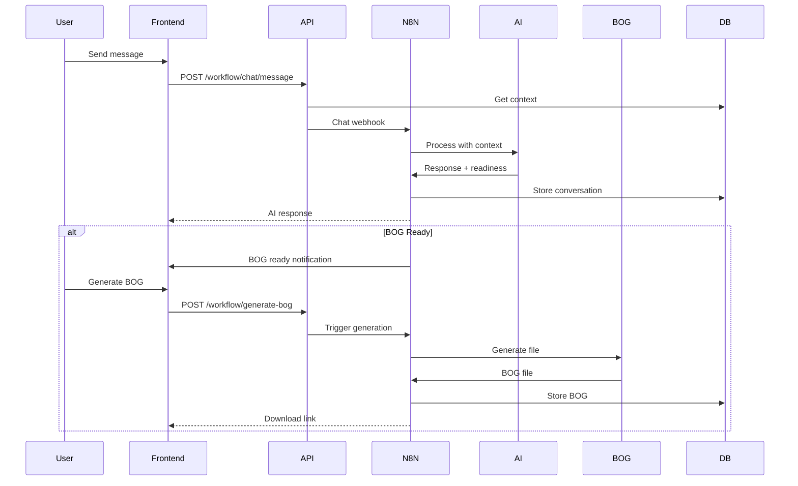
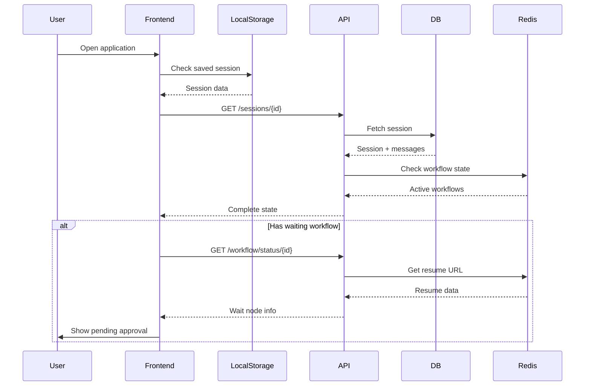

# PyBOG Enterprise Data Flow Architecture

## System Overview

PyBOG is an enterprise-grade HVAC Building Optimization and Generation system that orchestrates data flow through multiple layers:
- **Frontend**: React-based UI with real-time updates
- **Backend API**: FastAPI service layer
- **N8N Workflows**: Business logic and AI processing
- **Database**: PostgreSQL for persistence
- **Redis**: Session state and real-time messaging
- **Storage**: File management system

## Complete Data Flow Mapping

### 1. Frontend Layer (React Application)

```
Frontend Components:
├── App.tsx                     # Main application controller
├── Components/
│   ├── SimplifiedWorkbench.tsx # Session management UI
│   ├── ChatCanvas.tsx          # Message flow visualization
│   ├── WorkflowApproval.tsx    # Wait node approval UI
│   └── ChatCanvasGrid.tsx      # Grid-based chat interface
├── Services/
│   ├── workflowAPI.ts          # N8N workflow integration
│   ├── apiService.ts           # Core API calls
│   └── sessionPersistence.ts  # Session state management
└── Types/
    └── unified.ts              # Unified TypeScript interfaces
```

**Data Flow:**
1. User uploads documents → `workflowAPI.uploadDocuments()`
2. Files stream through FormData → Backend proxy → N8N webhook
3. SSE connection established → Real-time updates received
4. Wait nodes displayed → User approvals collected
5. Session state persisted → localStorage + Backend DB

### 2. Backend API Layer (FastAPI)

```
API Structure:
├── main.py                     # FastAPI application
├── Routes/
│   ├── workflow.py            # N8N workflow endpoints
│   ├── conversation.py        # Chat/message handling
│   ├── session_management.py  # Session CRUD operations
│   └── unified_sessions.py    # Unified session views
├── Services/
│   └── workflow_service.py    # N8N integration service
├── Models/
│   └── models.py              # SQLAlchemy ORM models
└── Integration/
    ├── n8n_integration.py     # N8N webhook calls
    └── n8n_resume.py          # Wait node resume handling
```

**API Endpoints:**

| Endpoint | Method | Purpose | Data Flow |
|----------|--------|---------|-----------|
| `/api/workflow/ingest/documents` | POST | Upload documents | Frontend → API → N8N → DB |
| `/api/workflow/chat/message` | POST | Send chat message | Frontend → API → N8N → AI → DB |
| `/api/workflow/approve` | POST | Handle approvals | Frontend → API → Redis → N8N |
| `/api/workflow/events/{session_id}` | GET/SSE | Event stream | N8N → Redis → SSE → Frontend |
| `/api/workflow/status/{session_id}` | GET | Workflow status | Redis → API → Frontend |
| `/api/workflow/analyze` | POST | Trigger analysis | Frontend → API → N8N → DB |
| `/api/workflow/generate-bog` | POST | Generate BOG | Frontend → API → N8N → Storage |

### 3. N8N Workflow Layer

```
Active Workflows:
├── PyBOG Document Ingestion Pipeline
│   ├── Webhook: /webhook/pybog-document-ingestion
│   ├── Text Extraction (PDF/Image/Text)
│   ├── Chunking & Embedding
│   ├── HVAC Component Extraction (AI)
│   ├── Database Storage
│   └── Notification
├── PyBOG Conversational Chat Agent
│   ├── Webhook: /webhook/pybog-chat
│   ├── Context Retrieval
│   ├── Semantic Search
│   ├── AI Processing (GPT-4)
│   ├── BOG Readiness Check
│   └── Response Generation
└── PyBOG Knowledge Base Import
    ├── Webhook: /webhook/pybog-kb-import
    └── Knowledge Storage
```

**Webhook Flow:**
1. Frontend initiates → Backend proxies → N8N webhook receives
2. N8N processes → Wait node pauses → Resume URL generated
3. Resume URL stored in Redis → Frontend notified via SSE
4. User action → Backend posts to resume URL → Workflow continues
5. Completion → Results stored in DB → Frontend updated

### 4. Database Layer (PostgreSQL)

```sql
Database Schema:
├── Core Tables
│   ├── sessions                 # Session management
│   ├── messages                 # Chat messages
│   ├── files                    # Uploaded files
│   ├── analysis_results         # Analysis data
│   └── bog_files               # Generated BOG files
├── N8N Integration Tables
│   ├── document_sessions        # Document processing
│   ├── conversation_history     # AI chat history
│   ├── document_embeddings      # Vector embeddings
│   ├── hvac_components         # Extracted components
│   ├── workflow_executions     # Workflow tracking
│   └── approval_history        # Approval audit trail
└── Views
    ├── session_overview         # Unified session data
    └── active_workflows        # Current workflow states
```

**Data Persistence Flow:**
1. Session created → UUID generated → Stored in `sessions`
2. Message sent → Stored in `messages` + `conversation_history`
3. File uploaded → Metadata in `files` → Content in storage
4. Analysis complete → Results in `analysis_results` + `hvac_components`
5. BOG generated → File in `bog_files` → Content in storage
6. Workflow state → Tracked in `workflow_executions`

### 5. Redis Layer

```
Redis Structure:
pybog:
├── session:{id}:
│   ├── resume_url              # Current wait node resume URL
│   ├── messages                # Message queue (list)
│   ├── events                  # SSE event channel
│   ├── state:
│   │   ├── current            # Current session state
│   │   └── previous           # Previous state
│   └── execution:
│       ├── executionId        # N8N execution ID
│       ├── workflowId         # N8N workflow ID
│       └── status             # Execution status
└── global:
    ├── active_sessions        # Set of active session IDs
    └── metrics               # System metrics
```

**Real-time Communication:**
1. Event published to Redis channel
2. SSE subscribers receive updates
3. Frontend updates UI in real-time
4. State changes tracked for audit

### 6. File Storage System

```
Storage Structure:
data/
├── uploads/                   # Incoming files
│   └── {session_id}/
│       └── {file_id}_{filename}
├── outputs/                   # Generated files
│   └── {session_id}/
│       ├── bog_files/
│       └── analysis_reports/
└── temp/                      # Temporary processing
```

## Complete Data Flow Scenarios

### Scenario 1: Document Upload and Analysis



### Scenario 2: Chat Conversation with BOG Generation



### Scenario 3: Session Restoration



## Security & Performance Considerations

### Security
- All file uploads stream through backend (no direct N8N access)
- Session-based authentication
- CORS properly configured
- Webhook URLs validated
- SQL injection prevention via ORM
- XSS prevention in React

### Performance
- SSE for real-time updates (no polling)
- Redis for fast state access
- Database indexes on key fields
- Lazy loading of large datasets
- File streaming (no memory buffering)
- Connection pooling for DB

### Scalability
- Stateless API design
- Redis for distributed state
- Horizontal scaling ready
- Queue-based processing
- Async operations throughout
- Docker containerization

## Monitoring & Observability

### Key Metrics
- Workflow execution times
- API response times
- SSE connection count
- Redis memory usage
- Database query performance
- File storage usage

### Logging
- Structured logging (JSON)
- Correlation IDs for tracing
- Error tracking
- Audit trail for approvals
- Performance metrics

### Health Checks
- `/health` - API health
- Database connectivity
- Redis connectivity
- N8N webhook availability
- Storage accessibility

## Deployment Architecture

```yaml
Docker Services:
  frontend:
    - React application
    - Nginx serving
    - Port: 3001
  
  api:
    - FastAPI application
    - Uvicorn server
    - Port: 8000
  
  n8n:
    - Workflow engine
    - Port: 5678
  
  postgres:
    - Database
    - Port: 5432
  
  redis:
    - Cache & messaging
    - Port: 6379
  
  pgadmin:
    - Database admin
    - Port: 5050
```

## Future Enhancements

1. **Authentication & Authorization**
   - OAuth2/OIDC integration
   - Role-based access control
   - API key management

2. **Advanced Features**
   - Multi-tenancy support
   - Workflow versioning
   - A/B testing for AI models
   - Advanced analytics dashboard

3. **Integration Capabilities**
   - External BMS integration
   - Cloud storage support
   - Email notifications
   - Slack/Teams integration

4. **Performance Optimization**
   - GraphQL API option
   - WebSocket upgrade from SSE
   - Caching layer enhancement
   - CDN for static assets

## Conclusion

This architecture provides a robust, scalable, and maintainable system for HVAC document processing and BOG generation. The clean separation of concerns, comprehensive error handling, and real-time communication ensure an enterprise-grade solution ready for production deployment.
